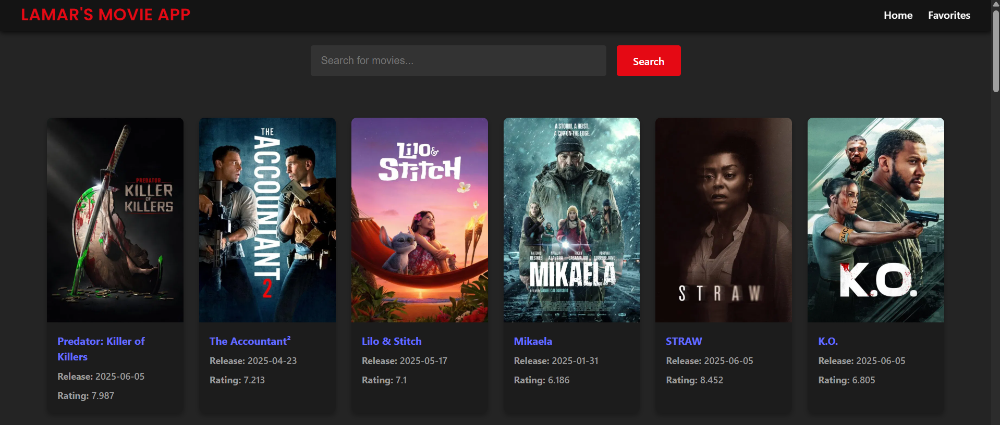
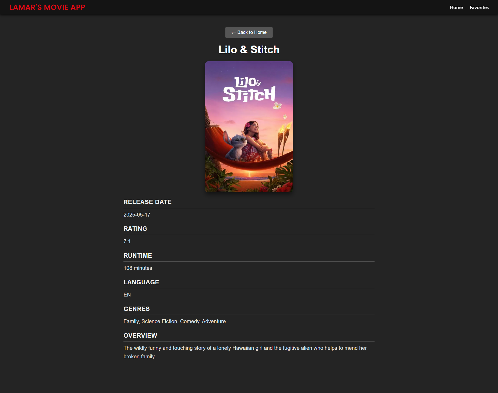
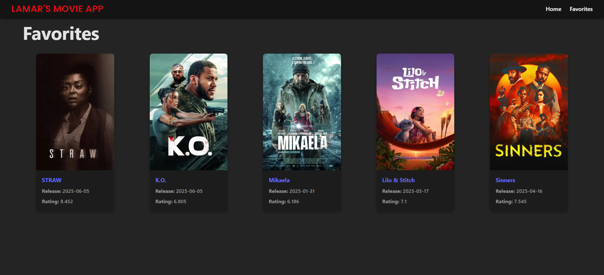

# 🎬 Movie Search Engine App

A modern React application to browse and search movies using The Movie Database (TMDB) API.  
Built as part of my personal portfolio to showcase React, API integration, and UI/UX skills.

## 🚀 Live Demo

👉 [View the app here](https://your-vercel-deployment-url.vercel.app)  
_(replace this link after you deploy on Vercel)_

## ✨ Features

✅ Browse popular movies  
✅ Search for movies by title  
✅ View detailed movie information (overview, genres, runtime, language, rating)  
✅ Add movies to **Favorites** → saved with localStorage → persists after refresh  
✅ Responsive design → works on desktop and mobile  
✅ Pagination → Load More movies  
✅ Animated loading spinner  
✅ Clean and modern UI  
✅ Deployed on Vercel

## 🖼️ Screenshots

### Home Page



### Movie Details Page



### Favorites Page



## 🛠️ Tech Stack

- React.js (Hooks, Context API)
- React Router DOM
- TMDB API
- CSS (custom + responsive grid)
- GitHub + Vercel (Deployment)

## 🏗️ How to Run Locally

1. Clone this repo:

````bash
git clone https://github.com/YOUR_USERNAME/MovieSearch.git
cd kishorekumar-movie-app


2. Install Dependencies and Run the App:

```bash
npminstall
npm run
````
